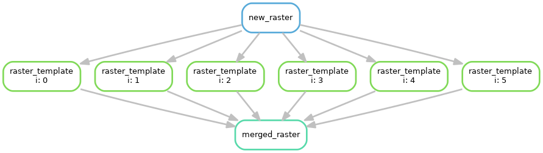

Snakemake - GRASS GIS interface
===============================
*Create reproducible and scaleable GRASS workflows*

:Author: Michel Wortmannn wortmann@pik-potsdam.de
:Version: **v0.1**

Requirements
------------
- `GRASS >= 7.8 <https://grass.osgeo.org/download/software/>`_
- `Snakemake <https://snakemake.readthedocs.io>`_
- Python >= 3.5 (Snakemake requirement)
- tested with Bash

Installation
------------
Latest release::

  $ pip install snakemake_grass

Latest development version::

  $ git clone git@github.com:mwort/snakemake_grass.git
  $ pip install -e ./snakemake_grass/

Rationale
---------
`Snakemake <https://snakemake.readthedocs.io>`_ is a great way to create
**reproducible, scaleable and portable** computational workflows based on input
and output file tracking (`Perkel 2019 <https://www.nature.com/articles/d41586-019-02619-z>`_).
This presents a challenge for the database approach of `GRASS <https://grass.osgeo.org>`_.
This Python module provides an interface between the two.

Docs and examples
-----------------
`API documentation <docs/snakemake.rst>`_

Here is a quick example Snakefile with one wildcard/template rule and two
target rules::

  from snakemake_grass import GrassLocation, input_to_map, output_to_map
  
  grass_ll = GrassLocation('grassdb', 'lonlat', epsg=4326)

  rule new_raster:
      output: grass_ll.raster('new_raster')
      shell: grass_ll('r.mapcalc', exp='new_raster=1')

  rule raster_template:
      input: rules.new_raster.output
      output: grass_ll.raster('raster{i}@raster{i}')
      shell:
          grass_ll('r.mapcalc', mapset=output_to_map(),
                   exp='raster{wildcards.i}={wildcards.i}')

  rule merged_raster:
      input: grass_ll.rasters('raster{i}@raster{i}', i=range(6))
      output: grass_ll.raster('merged_raster')
      shell:
          grass_ll('r.series', input=[input_to_map(i) for i in range(6)],
                   method='count', output=output_to_map())

Run the last rule on 3 CPUs and create a graph of the workflow::

  $ snakemake -j 3 merged_raster
  $ snakemake --dag merged_raster | dot -T png -o dag.png

Instead of running ``r.mapcalc``/``r.series``, it may be more common to actually run
entire Bash/Python script but any one command will work. For more examples, see
`<tests/Snakefile>`_.

Tests
-----
Tests are provided in a `<tests/Snakefile:Snakefile>`_ and are run in the
``tests/`` directory like this, e.g. on 3 CPUs::
  $ snakemake -j 3 all
  $ snakemake clean
